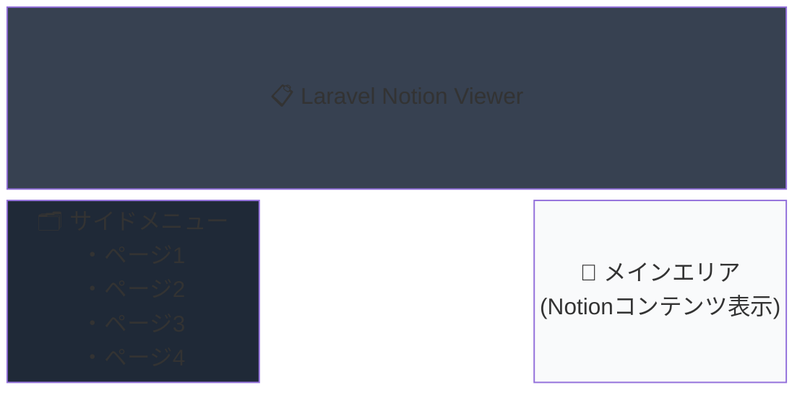

# Laravel Notion Viewer

Notionで作成したページを外部サイトで表示するシステム。左サイドメニューでページ一覧が表示され、メインエリアにNotionのコンテンツが表示されます。

## 📋 プロジェクト概要

### 目標UI構成



### 実装済み機能

- ✅ サイドメニューにページ一覧表示
- ✅ メインエリアにNotionコンテンツ表示  
- ✅ ページ切り替え機能
- ✅ レスポンシブ対応（モバイルファースト）
- ✅ キャッシュ機能（5分間）
- ✅ サンプルデータ表示（API未設定時）

## 🚀 クイックスタート

### 前提条件

- PHP 8.2以上
- Composer
- Apache または Nginx
- VPS環境（本番運用の場合）

### ローカル開発環境での起動

```bash
# 1. 依存関係のインストール
composer install

# 2. 環境設定ファイルのコピー
cp .env.example .env

# 3. アプリケーションキーの生成
php artisan key:generate

# 4. 開発サーバーの起動
php artisan serve

# ブラウザでアクセス
# http://localhost:8000
```

## 📁 プロジェクト構成

```
NotionView/
├── .env                                # 環境変数（NotionのAPIキー）
├── .env.production                     # 本番環境用設定
├── routes/web.php                      # ルート設定
├── app/Http/Controllers/
│   └── NotionController.php            # メインコントローラー
├── resources/views/notion/
│   ├── index.blade.php                 # トップページ
│   └── show.blade.php                  # ページ詳細表示
├── config/                             # 各種設定ファイル
├── public/                             # 公開ディレクトリ
│   ├── index.php                       # エントリーポイント
│   └── .htaccess                       # URL書き換え設定
└── composer.json                       # パッケージ管理
```

## ⚙️ Notion API設定

### 1. Integration作成

1. https://www.notion.com/my-integrations にアクセス
2. 「New integration」をクリック
3. 名前を設定（例：Laravel Notion Viewer）
4. Capabilitiesで「Read content」を有効化
5. 「Submit」で作成

### 2. Token取得

作成したIntegrationの「Internal Integration Token」をコピー

### 3. Notionページ/データベースに統合を追加

1. 表示したいNotionページ/データベースを開く
2. 右上の「...」メニュー → 「Connections」
3. 作成したIntegrationを検索して追加

### 4. Database ID取得

NotionデータベースのURLから取得：
```
https://www.notion.so/workspace/xxxxxx?v=yyyyyy
                                ^^^^^^ この部分がDatabase ID
```

### 5. .envファイルに設定

```env
NOTION_API_TOKEN=your_integration_token_here
NOTION_DATABASE_ID=your_database_id_here
```

## 🌐 本番環境セットアップ（VPS）

### DNS設定

ドメイン管理画面で以下を設定：
```
Aレコード: notion.sho43.xyz → VPSのIPアドレス
```

### 本番環境用の.env設定

```bash
# 本番用の.envをコピー
cp .env.production .env

# Notion APIの設定を編集
nano .env
# NOTION_API_TOKEN と NOTION_DATABASE_ID を実際の値に変更
```

### Laravelの最適化

```bash
# 設定キャッシュ
php artisan config:cache

# ルートキャッシュ
php artisan route:cache

# ビューキャッシュ
php artisan view:cache

# オートローダー最適化
composer install --optimize-autoloader --no-dev
```

### Apache設定

```bash
# Apache設定ファイルをコピー
sudo cp apache-vhost.conf /etc/httpd/conf.d/notion.conf

# Apacheを再起動
sudo systemctl restart httpd
```

### SSL証明書の設定（Let's Encrypt）

```bash
# Certbotのインストール
sudo dnf install certbot python3-certbot-apache -y

# SSL証明書の取得
sudo certbot --apache -d notion.sho43.xyz

# 自動更新の設定
sudo systemctl enable certbot-renew.timer
sudo systemctl start certbot-renew.timer
```

### ファイアウォール設定

```bash
# HTTPとHTTPSを許可
sudo firewall-cmd --permanent --add-service=http
sudo firewall-cmd --permanent --add-service=https
sudo firewall-cmd --reload
```

### 権限設定

```bash
# 適切な権限を設定
sudo chown -R apache:apache /var/www/vhosts/NotionView
sudo chmod -R 755 /var/www/vhosts/NotionView
sudo chmod -R 775 /var/www/vhosts/NotionView/storage
sudo chmod -R 775 /var/www/vhosts/NotionView/bootstrap/cache
```

## 🔒 セキュリティ設定

### デバッグモードの無効化

.envファイルで以下を確認：
```env
APP_DEBUG=false
APP_ENV=production
```

### HTTPSリダイレクト

SSL証明書取得後、Apacheの設定で自動的に設定されます。

## 📊 パフォーマンス最適化

### OPcacheの有効化

`/etc/php.ini`に以下を設定：
```ini
opcache.enable=1
opcache.memory_consumption=128
opcache.max_accelerated_files=10000
opcache.revalidate_freq=2
```

### キャッシュ戦略

- Notion APIレスポンスは5分間キャッシュ
- ビューとルートは本番環境でキャッシュ
- 設定は`php artisan config:cache`でキャッシュ

## 🔄 メンテナンス

### キャッシュのクリア

```bash
php artisan cache:clear
php artisan config:clear
php artisan route:clear
php artisan view:clear
```

### 更新時の手順

```bash
# コードの更新
git pull

# 依存関係の更新
composer install --optimize-autoloader --no-dev

# キャッシュの再生成
php artisan config:cache
php artisan route:cache
php artisan view:cache
```

## 🔍 動作確認

### DNS伝播の確認
```bash
nslookup notion.sho43.xyz
```

### Webサイトアクセス
- 開発環境: http://localhost:8000
- 本番環境（SSL設定前）: http://notion.sho43.xyz
- 本番環境（SSL設定後）: https://notion.sho43.xyz

### ログの確認
```bash
# Laravelログ
tail -f storage/logs/laravel.log

# Apacheログ（本番環境）
sudo tail -f /var/log/httpd/notion-access.log
sudo tail -f /var/log/httpd/notion-error.log
```

## ⚠️ トラブルシューティング

### 500エラーが表示される場合

```bash
# ログを確認
tail -f storage/logs/laravel.log

# 権限を再設定
sudo chmod -R 775 storage bootstrap/cache
```

### ページが表示されない場合

```bash
# Apacheの設定を確認
sudo apachectl configtest

# SELinuxの設定（必要に応じて）
sudo setsebool -P httpd_can_network_connect 1
```

### Notion APIが機能しない場合

1. .envファイルのAPIトークンとデータベースIDを確認
2. Notionでインテグレーションが共有されているか確認
3. キャッシュをクリア: `php artisan cache:clear`

## 💰 コスト

- **Notion API**: 完全無料（レート制限: 3req/sec）
- **VPS**: 月額数百円〜
- **SSL証明書**: Let's Encryptで無料
- **ドメイン**: 年額1,000円程度

## 🔗 リソース

- [Notion API Documentation](https://developers.notion.com/)
- [Laravel Documentation](https://laravel.com/docs)
- [Notion Integration Dashboard](https://www.notion.com/my-integrations)

## 📝 ライセンス

このプロジェクトはオープンソースです。

---

**作成者**: NotionView Project  
**最終更新**: 2025年9月