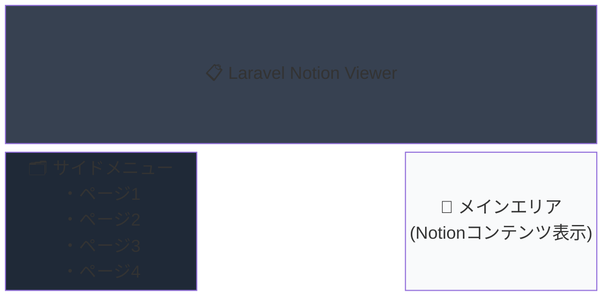

# Notion表示システム

Notionで作成した共有URLを表示する仕組みの実装ガイドとプロジェクト要件

## 📋 プロジェクト概要

Notionで作成したページを外部サイトで表示するシステム。左サイドメニューで自分たちが設定したページ一覧が表示され、メインエリアにNotionのコンテンツが表示される構成。

### 目標UI構成



## ⚠️ 技術的制約

### iframe埋め込みは不可能

```log
Refused to frame 'https://www.notion.so/' because an ancestor violates the following Content Security Policy directive: "frame-ancestors 'self' https://mail.notion.so".
```

**結論**: NotionはContent Security Policy (CSP)により外部サイトからのiframe埋め込みを禁止している。

## ✅ 実現可能なアプローチ

### 1. Notion API方式（推奨）
- **メリット**: 完全カスタマイズ可能、安定動作
- **デメリット**: 実装コストがかかる
- **無料範囲**: API使用料無料、レート制限あり（3req/sec）

### 2. プリレンダリング方式
- **メリット**: 高速表示、SEO対応
- **デメリット**: リアルタイム更新が困難

### 3. Notionサイト公開 + カスタムUI
- **メリット**: 実装が簡単
- **デメリット**: カスタマイズに制限

## 💰 コスト分析

### 🆓 完全無料で実現可能

| 項目 | 無料範囲 | 制限事項 |
|------|---------|----------|
| **Notion API** | 完全無料 | レート制限: 3req/sec |
| **Notionワークスペース** | Freeプラン | 個人利用: 制限なし<br>チーム利用: 1,000ブロック制限 |
| **ホスティング** | Vercel/Netlify | 個人利用範囲内 |
| **ファイルアップロード** | 5MB以下 | それ以上は有料プラン必要 |

## 🛠 推奨技術スタック

## 🛠 技術構成

### Laravel シンプル構成（推奨）
```bash
必要なもの:
- Laravel 10/11 + PHP 8.2+
- laravel-notion-api パッケージ  
- Tailwind CSS（スタイリング）
- 共用サーバーまたはVPS

これだけで完成！
```

### 🎯 なぜLaravelが最適？

| 項目 | Laravel | 他のフレームワーク |
|------|---------|-------------------|
| **学習コスト** | PHP知識だけでOK | 新言語・概念の習得必要 |
| **ファイル数** | 5-6ファイル | 10ファイル以上 |
| **デプロイ** | FTPアップロードでOK | 特殊な設定・ビルドが必要 |
| **運用コスト** | 月数百円（共用サーバー） | 月数千円または制限あり |
| **保守** | 1つのプロジェクトのみ | 複数技術の組み合わせ |

### ❓ 他の選択肢は？
**Laravel以外も選べますが、個人開発なら不要です：**
- Next.js → JSフレームワーク（複雑）
- Nuxt.js → Vueフレームワーク（複雑）  
- API分離構成 → 管理が大変

**Laravel1本で十分シンプルに作れます！**

## 🚀 Laravel セットアップ手順

### ステップ1: Laravel プロジェクト作成（5分）
```bash
# Laravel新規プロジェクト作成
composer create-project laravel/laravel notion-viewer
cd notion-viewer

# Laravel Notion APIパッケージインストール
composer require 5am-code/laravel-notion-api

# 設定ファイル公開（オプション）
php artisan vendor:publish --provider="FiveamCode\LaravelNotionApi\LaravelNotionApiServiceProvider"
```

### ステップ2: Notion API設定（5分）
```bash
# .envファイルに追加
NOTION_API_TOKEN=your_integration_token
NOTION_DATABASE_ID=your_database_id
```

**Notion API Token取得方法:**
1. https://www.notion.com/my-integrations でIntegration作成
2. Internal Integration Token をコピー
3. 対象ページ/データベースに統合を共有

### ステップ3: 基本コード実装（30分）

#### ルート設定
```php
// routes/web.php
Route::get('/', [NotionController::class, 'index']);
Route::get('/page/{pageId}', [NotionController::class, 'show'])->name('notion.show');
```

#### コントローラー作成
```bash
php artisan make:controller NotionController
```

```php
// app/Http/Controllers/NotionController.php
<?php

namespace App\Http\Controllers;

use Illuminate\Http\Request;
use FiveamCode\LaravelNotionApi\Notion;

class NotionController extends Controller
{
    public function index()
    {
        // Notionデータベースからページ一覧取得
        $pages = Notion::database(env('NOTION_DATABASE_ID'))
            ->limit(50)
            ->query()
            ->asCollection();
            
        return view('notion.index', compact('pages'));
    }
    
    public function show($pageId)
    {
        // 特定のページ詳細取得
        $page = Notion::pages()->find($pageId);
        
        // サイドバー用のページ一覧も取得
        $pages = Notion::database(env('NOTION_DATABASE_ID'))
            ->limit(50)
            ->query()
            ->asCollection();
        
        return view('notion.show', compact('page', 'pages'));
    }
}
```

#### ビューテンプレート作成
```bash
mkdir -p resources/views/notion
```

```blade
{{-- resources/views/notion/index.blade.php --}}
<!DOCTYPE html>
<html lang="ja">
<head>
    <meta charset="UTF-8">
    <meta name="viewport" content="width=device-width, initial-scale=1.0">
    <title>Notion Viewer</title>
    <script src="https://cdn.tailwindcss.com"></script>
</head>
<body class="bg-gray-100">
    <div class="flex min-h-screen">
        {{-- サイドバー --}}
        <div class="w-64 bg-gray-800 text-white p-4">
            <h1 class="text-xl font-bold mb-6">📋 Notion Pages</h1>
            <ul class="space-y-2">
                @foreach($pages as $page)
                    <li>
                        <a href="{{ route('notion.show', $page->getId()) }}" 
                           class="block p-3 rounded hover:bg-gray-700 transition-colors">
                            {{ $page->getTitle() ?? 'Untitled' }}
                        </a>
                    </li>
                @endforeach
            </ul>
        </div>
        
        {{-- メインコンテンツ --}}
        <div class="flex-1 p-8">
            <div class="max-w-4xl mx-auto">
                <h2 class="text-3xl font-bold mb-6">Welcome to Notion Viewer</h2>
                <p class="text-gray-600">左のメニューからページを選択してください。</p>
            </div>
        </div>
    </div>
</body>
</html>
```

```blade
{{-- resources/views/notion/show.blade.php --}}
<!DOCTYPE html>
<html lang="ja">
<head>
    <meta charset="UTF-8">
    <meta name="viewport" content="width=device-width, initial-scale=1.0">
    <title>{{ $page->getTitle() }} - Notion Viewer</title>
    <script src="https://cdn.tailwindcss.com"></script>
</head>
<body class="bg-gray-100">
    <div class="flex min-h-screen">
        {{-- サイドバー --}}
        <div class="w-64 bg-gray-800 text-white p-4">
            <h1 class="text-xl font-bold mb-6">📋 Notion Pages</h1>
            <ul class="space-y-2">
                @foreach($pages as $sidebarPage)
                    <li>
                        <a href="{{ route('notion.show', $sidebarPage->getId()) }}" 
                           class="block p-3 rounded transition-colors 
                                  {{ $sidebarPage->getId() === $page->getId() ? 'bg-gray-700' : 'hover:bg-gray-700' }}">
                            {{ $sidebarPage->getTitle() ?? 'Untitled' }}
                        </a>
                    </li>
                @endforeach
            </ul>
        </div>
        
        {{-- メインコンテンツ --}}
        <div class="flex-1 p-8">
            <div class="max-w-4xl mx-auto">
                <h1 class="text-3xl font-bold mb-6">{{ $page->getTitle() ?? 'Untitled' }}</h1>
                
                {{-- ここにNotionページの内容を表示 --}}
                <div class="bg-white rounded-lg shadow p-6">
                    <p class="text-gray-600">Notionページの内容がここに表示されます。</p>
                    {{-- より詳細な内容表示の実装は後述 --}}
                </div>
            </div>
        </div>
    </div>
</body>
</html>
```

### ステップ4: 動作確認
```bash
# ローカル開発サーバー起動
php artisan serve

# ブラウザで確認
# http://localhost:8000
```

**これで基本的なNotionビューアーの完成！**

## 📁 Laravel プロジェクト構成

**必要最小限の構成**（5つのファイルだけ）：

```
laravel-notion-viewer/
├── .env                                # 環境変数（NotionのAPIキー）
├── routes/web.php                      # ルート設定（2行だけ）
├── app/Http/Controllers/
│   └── NotionController.php            # メイン処理（30行程度）
├── resources/views/notion/
│   ├── index.blade.php                 # トップページ（サイドバー+メイン）
│   └── show.blade.php                  # ページ表示（サイドバー+コンテンツ）
└── composer.json                       # laravel-notion-api パッケージ追加済み
```

### 🎯 動作の流れ
1. `http://localhost:8000/` → ページ一覧表示
2. サイドバーのページクリック → そのページの内容表示  
3. 完成！

### 🔧 カスタマイズポイント
- **スタイリング**: Tailwind CDN で簡単変更
- **レスポンシブ**: 既に対応済み
- **ページ取得数**: `->limit(50)` で調整可能

## 🔧 実装上の考慮事項

### パフォーマンス最適化
- **キャッシュ戦略**: ISR (Incremental Static Regeneration) 活用
- **画像最適化**: Next.js Image コンポーネント使用
- **コード分割**: 動的import活用

### セキュリティ
- **API Key管理**: サーバーサイドでのみ使用
- **CORS設定**: 適切なオリジン制限
- **レート制限**: クライアント側での制御実装

### UX/UI
- **ローディング状態**: Skeleton UI実装
- **エラーハンドリング**: 適切なフォールバック
- **レスポンシブ対応**: モバイルファーストデザイン

## 📊 機能要件（個人開発版）

### 🎯 最小機能（これだけで十分）
- [ ] サイドメニューにページ一覧表示
- [ ] メインエリアにNotionコンテンツ表示  
- [ ] ページ切り替え機能
- [ ] スマホ対応（レスポンシブ）

### ❌ 個人開発では不要な機能
- [ ] ユーザー認証・権限管理
- [ ] コメント機能
- [ ] 複雑な管理画面
- [ ] マルチテナント対応
- [ ] 検索機能
- [ ] お気に入り機能  
- [ ] ダークモード
- [ ] ページ履歴

## 🔗 リソースリンク

### 公式ドキュメント
- [Notion API Documentation](https://developers.notion.com/)
- [Notion SDK for JavaScript](https://github.com/makenotion/notion-sdk-js)
- [Notion Integration Dashboard](https://www.notion.com/my-integrations)

### 参考実装
- [notion-blog](https://github.com/ijjk/notion-blog) - Next.js + Notion
- [react-notion-x](https://github.com/NotionX/react-notion-x) - React Notion レンダラー

## ⚡ 3ステップで完成

### ステップ1: Laravel環境準備
```bash
composer create-project laravel/laravel notion-viewer
composer require 5am-code/laravel-notion-api
```

### ステップ2: Notion API設定
- https://www.notion.com/my-integrations でToken取得
- `.env` ファイルに設定

### ステップ3: コード実装
- Controller作成（30行）
- View作成（2ファイル）
- Route設定（2行）

追加の学習・設定・ビルドは一切不要。Laravel知識だけで完結します。

---
